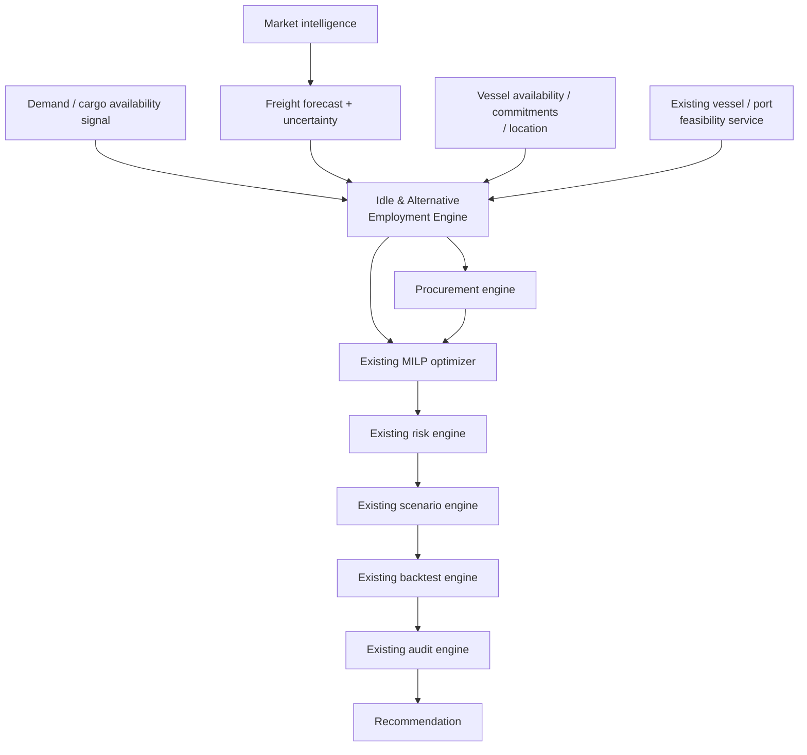
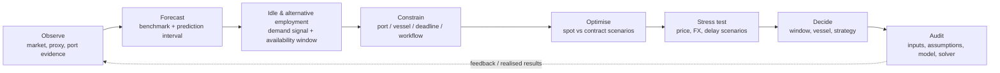
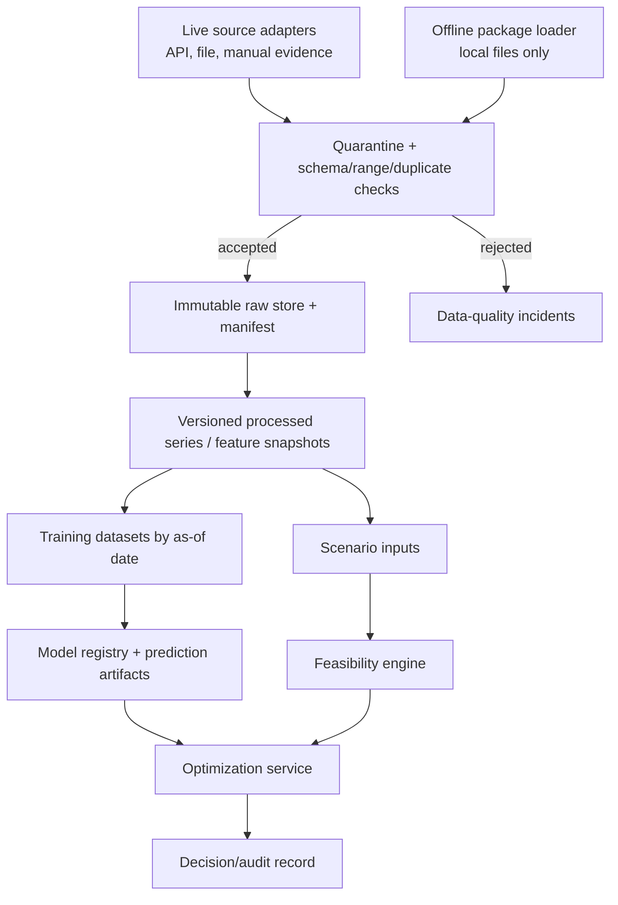
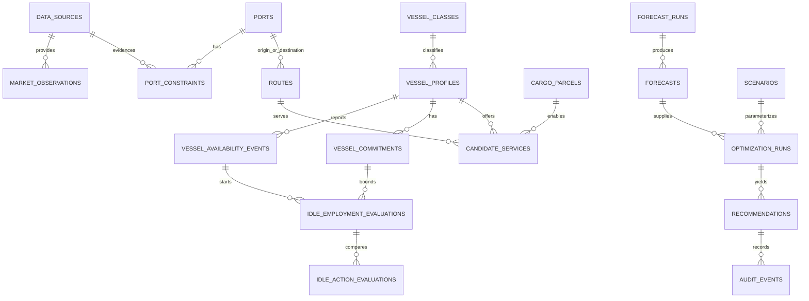

# VESSELOPTIMA — MASTER BUILD SPECIFICATION v1.0

**Status:** Build-ready research and architecture source of truth  
**Prepared:** 4 September 2026  
**Scope:** SIH26006 prototype; no production or procurement approval is implied.

## Document contract

This is deliberately a decision-support specification, not a promise that an ML model can forecast freight perfectly or that a prototype can replace a chartering desk. The system must preserve the provenance, licence, timestamp, and confidence of every decision input. It must decline to calculate a fact when its source is missing.

### Claim labels (mandatory in UI, reports, APIs, and slides)

| Label | Meaning | Permitted evidence |
|---|---|---|
| **PROVEN** | Directly supported by an attributed source or recorded observation | URL/document, version, effective date, ingestion timestamp |
| **MODELED** | Output of a documented deterministic/ML calculation using disclosed inputs | model/solver version, inputs, run ID, validation result |
| **DEMO ASSUMPTION** | Frozen illustrative input, never a market fact | owner, rationale, validity period, `demo=true` |
| **PROXY ESTIMATE** | Derived proxy; not an observed route quote | formula/calibration/version and all source inputs |
| **DATA UNAVAILABLE** | Required input is absent or stale | missing fields and recovery action |

These tags are not decorative. A recommendation must be downgraded to `MONITOR — INSUFFICIENT EVIDENCE` if a blocking input is unavailable or unverified.

---

## Mandatory architecture amendment — LIVE and OFFLINE DEMO runtime modes

**Revision date:** 4 September 2026  
**Status:** Mandatory; this amendment supersedes every earlier runtime/deployment/data-flow implication that conflicts with it.

### Non-negotiable rule

VesselOptima supports exactly two explicit modes: **LIVE** and **OFFLINE DEMO**. A runtime has one mode, selected deliberately by an authorized operator and persisted with a mode-selection audit event. Network availability must never infer or change that mode. There is no third/mixed operating mode, no automatic source substitution, no partial-live execution mode, and no silent change from LIVE to OFFLINE DEMO.

* In **LIVE**, only configured/entitled external source adapters may refresh data. A required source failure is an explicit `LIVE DATA ERROR`; the application remains stable, shows its last successful ingestion for diagnosis, and blocks dependent fresh-data calculations/recommendations. It must not use a stale cache, different source, or frozen demo package as a substitute.
* In **OFFLINE DEMO**, outbound network access is deliberately disabled. Only one selected, validated local snapshot package and compatible local model artifacts may serve data. Every decision, forecast, backtest and scenario carries the snapshot package ID and hashes.
* Both modes feed the same normalized contracts, common data services, forecast/optimization/risk/backtest engines, FastAPI and Next.js UI. They are data-source contexts in one product and one codebase—not two applications.

```mermaid
flowchart TD
  L[LIVE\nconfigured external sources] --> LI[Live ingestion adapters]
  D[OFFLINE DEMO\nversioned local snapshot] --> DI[Offline package loader]
  LI --> N[Validation + normalization\nshared data contracts]
  DI --> N
  N --> C[Common data services]
  C --> F[Forecasting engine\nlocal inference artifacts]
  C --> O[Feasibility + MILP optimization]
  C --> R[Risk / scenario / backtest]
  F --> A[FastAPI]\n  O --> A
  R --> A
  A --> U[Next.js terminal]
```

### Changed architecture sections

| Existing section | Mandatory revision |
|---|---|
| A, F, G | Define the two-mode contract, status/error policy, data paths and offline package |
| H–J | Add local, manifest-verified model/explainability artifacts; inference never retrains at start |
| S | Persist package, artifact and mode provenance on all runs/decisions |
| T–U | Add mode/status APIs and separate live/offline loaders feeding shared normalization |
| V–W | Add compact mode selector/status; show mode and source state in every decision surface |
| Y–Z | Assign mode ownership and add connectivity/isolation/determinism tests |
| AB–AE | Define offline deployment, repository changes, implementation phases and SIH demo workflow |
| AF–AH | Add judge answer, failure policy, risk register and release checklist |

### Mode-selection and status contract

Mode changes are explicit: the user selects `LIVE` or `OFFLINE DEMO`, confirms the impact, and the backend verifies preconditions before committing it. In a multi-user deployment this is an authorized workspace/environment setting, not a browser-only toggle. Every API response includes `runtime_mode`, `mode_session_id`, and `data_context_id`; every long-running run locks those values at creation.

The terminal header uses a compact status control, e.g. `DATA: LIVE  ●  4/5 SOURCES HEALTHY` or `DATA: OFFLINE DEMO  ◉ PACKAGE VO-2026.09.01`. It is not a marketing badge. Selecting LIVE while disconnected displays `LIVE MODE — CONNECTIVITY OFFLINE` and a source table with status, last successful ingestion, error and recovery action. Selecting OFFLINE DEMO explicitly disables source-refresh controls and displays the frozen package coverage; it makes no external request.

---

## Mandatory architecture amendment — Idle & Alternative Employment Engine

**Revision date:** 4 September 2026  
**Scope:** Targeted SIH26006 requirement (c) enhancement. It preserves the modular-monolith stack, forecasting, feasibility, procurement, MILP, risk, scenario, backtest, audit, and the two explicit runtime modes.

### Requirement mapping

SIH26006 requirement (c)—forecast low demand and suggest alternative employment or positioning to reduce idle time/deadheading—is implemented as the first-class **Idle & Alternative Employment Engine**. It is not a fleet-tracking product, a generic idle dashboard, or a competing forecast/scenario/audit service.



The diagram expresses dependencies, not a fragile serial workflow. The engine reuses shared feasibility, voyage/cost, risk, scenario and audit contracts; it creates candidate actions and evidence for the optimizer rather than duplicate versions of those engines.

### Applicability / authority gate

Alternative employment is actionable only when the decision owner has contractual authority to direct the vessel’s employment (owned/controlled fleet, pool, time-charter right, or a documented agreement). A bulk cargo procurer using voyage charters may not have that right. `employment_control_status` is therefore a hard input. If it is absent or false, the engine may calculate an informational idle exposure but returns `ALTERNATIVE EMPLOYMENT NOT ACTIONABLE — EMPLOYMENT RIGHTS NOT ESTABLISHED`; it must not recommend a third-party vessel for another cargo.

### Inspection and gap analysis

| Category | Result |
|---|---|
| Already specified / reused | vessel profiles, routes, candidate services, cargo parcels, port feasibility, cost terms, forecast/interval artifacts, local MILP, risk/stress scenarios, backtest rules, provenance and audit records |
| Must be made explicit | engine boundary, availability/commitment/location inputs, idle-window algorithm, cargo-opportunity contract, action candidates, authority gate, decision explanation and terminal screen |
| Must be extended minimally | candidate-service/cargo metadata, an availability/commitment relation, derived idle evaluation/audit data, package contents, optimizer action variables, mode-safe endpoints/tests |
| Must not be added | another forecasting engine, a separate optimizer/risk/scenario/audit stack, global AIS/fleet intelligence claims, external APIs in OFFLINE DEMO, or a third mode |

**Workspace implementation status:** this workspace contains the architecture document only; it has no backend, frontend, database migration, model or test source tree to modify. The file paths, contracts and tests below are implementation instructions. Runtime `PASS` claims are intentionally deferred until that codebase and offline package exist.

### Before / after architecture diff

```text
BEFORE
Market / freight forecast → vessel-port feasibility → procurement → MILP
→ risk → scenario → backtest → audit → recommendation

AFTER
Market / freight forecast + demand/cargo availability + vessel commitments
→ vessel-port feasibility → IDLE & ALTERNATIVE EMPLOYMENT ENGINE
→ procurement + existing MILP → risk → scenario → backtest → audit → recommendation
```

### Engine contract and decision workflow

```text
Vessel availability + next committed employment + location
  → potential idle window / duration / utilization exposure
  → candidate actions: WAIT | REPOSITION | ALTERNATIVE EMPLOYMENT
  → existing feasibility and voyage/cost services
  → risk-adjusted action economics
  → existing MILP selection
  → existing scenario, backtest and audit services
```

`Demand / cargo availability signal` reuses the forecasting/data architecture. In priority order it is: an approved cargo plan or observed opportunity; a licensed/validated availability model; or a labelled OFFLINE DEMO scenario assumption. It must not invent a separate low-demand forecast or commercial cargo opportunity. All uncertainty is preserved in action probabilities/scenarios.

### Idle-window detection

For a controlled vessel \(v\), derive `available_at` from verified current-voyage completion or availability event, and `next_committed_at` from the next immutable commitment. If \(next\_committed\_at > available\_at\), create:

\[
W_v=[available\_at, next\_committed\_at),\qquad idle\_days_v=\max(0, next\_committed\_at-available\_at)
\]

When no next commitment exists, use a configurable planning horizon and mark the end as `PLANNING_HORIZON`, not a known employment date. Thresholds such as “high idle risk after 5 days” are policy parameters with units, owner and version; no threshold is hard-coded. A window is not actionable until vessel location, capability, control status and relevant time fields pass data-quality checks.

### Candidate actions and economics

| Action | Candidate generation | Reused checks / costs | Selectable only when |
|---|---|---|---|
| `WAIT` | Remain at current confirmed location for all/part of the window | configured idle/OPEX, opportunity exposure, next commitment | always; it is the safe comparator |
| `REPOSITION` | Generate a permitted destination/positioning point from a known next commitment or approved demand signal | route distance/time, consumption, bunker, port/deadhead and schedule services | arrival preserves commitments and the position has stated economic purpose |
| `ALTERNATIVE_EMPLOYMENT` | Match an observed/licensed or explicitly labelled demo cargo opportunity | vessel/capacity/port/window feasibility, repositioning, voyage, freight/contribution and risk services | employment-control authority, candidate feasibility and schedule compatibility pass |

For action \(a\) under scenario \(\omega\), use the existing cost schema:

\[
C_{v,a,\omega}=C^{idle}_{v,a,\omega}+C^{reposition}_{v,a,\omega}+C^{deadhead}_{v,a,\omega}+C^{bunker}_{v,a,\omega}+C^{port}_{v,a,\omega}+C^{delay}_{v,a,\omega}-p^{availability}_{v,a,\omega}\,Contribution_{v,a,\omega}
\]

Only present a contribution/revenue term when its commercial basis and authority are known. Otherwise mark it unavailable and compare supported costs/exposure only. Demo configuration and synthetic opportunity values keep their existing tags; no invented market opportunity or financial claim is permitted.

### Optimizer extension (not replacement)

For idle window \(w\) of vessel \(v\), add mutually exclusive action variables \(y_{vwa}\in\{0,1\}\) for \(a\in\{WAIT, REPOSITION, ALTERNATIVE\_EMPLOYMENT\}\), and alternative assignment \(x_{vwj}\in\{0,1\}\) for compatible opportunity \(j\):

\[
\sum_a y_{vwa}=1;\qquad x_{vwj}\le y_{vw,ALTERNATIVE\_EMPLOYMENT};\qquad x_{vwj}\le feasible_{vwj}
\]

\[
arrival_{vwj}+duration_j\le next\_committed\_at_v+slack_v+M(1-x_{vwj})
\]

The existing expected-cost plus CVaR/risk objective incorporates \(C_{v,a,\omega}\). `WAIT` remains feasible whenever data are sufficient; the model cannot force repositioning or employment merely to reduce a dashboard number. Candidate action data join the existing finite candidate-service set, capacity, deadline, port and strategy constraints.

---

## SECTION A — Executive summary

**Go, with a narrower claim.** VesselOptima is feasible as an SIH decision-support prototype if it forecasts a licensed or openly provided *market benchmark*, applies an explicitly labelled route-cost proxy only where calibration/assumptions exist, gates vessel choices through versioned port constraints, and optimizes a finite scenario. It is not data-feasible to promise live, route-level Australia/US/Mozambique/Indonesia-to-East-Coast-India freight forecasts using only free public data.

The defensible product is an India-focused pre-fixture decision workbench:



The MVP decision loop is: selected cargo and ports → data-quality gate → 7/14/30-day benchmark forecast → feasible vessel classes → constrained cost comparison → procurement initiation date → explanation and audit record. Where a controlled demo vessel and opportunity set are supplied, it also evaluates an idle window and `WAIT`/`REPOSITION`/`ALTERNATIVE EMPLOYMENT` actions through the same constraints and optimizer. The map, live AIS, true fleet redeployment, autonomous contracting, deep-learning models, and claims of realized savings are out of scope for the 36-hour build.

The SIH archive describes the requested need as forecasting for vessel types/routes, port constraints, idle-time reduction, risk mitigation, and movement toward short/medium-term multiple-voyage contracts. It is the product requirement—not evidence that the needed commercial data are freely available. [SIH26006 statement](https://sih2026.vuce.in/en/ps/SIH26006)

---

## SECTION B — SIH26006 requirements mapping

| Official need | MVP response | Proof during demo | Boundary |
|---|---|---|---|
| Forecast future freight rates | Forecast BCI/BPI/BDI-compatible market benchmark, with baseline comparison and prediction interval | Historical/forecast chart, metrics and provenance | Not labelled a quoted route freight rate |
| Market-entry timing | Deterministic timing policy uses forecast percentile, estimated saving, interval width, and configurable lead time | Charter and tender-window panel | Recommendation is conditional, not a trading guarantee |
| Suitable vessel type | Server-side feasibility rules then cost/arrival optimization | pass/fail reasons for each class | An actual vessel requires its own profile and current port clearance |
| Port constraints | Versioned draft/LOA/beam/berth/handling records | source and verified date shown per rule | Unknown/stale conditions block automated feasibility |
| Idle scenario management | Detect controlled-vessel idle windows; compare WAIT, repositioning and compatible alternative employment through existing feasibility/MILP | candidate data, cost/risk drivers, reasoned recommendation and audit | No claim of global fleet availability or authority over third-party vessels |
| Market/operational risk | Reproducible stress cases and interval-aware costs | base versus stressed comparison | Does not predict black swans |
| Spot to multi-voyage move | Compare supplied quote/assumption structures by expected cost and risk | strategy table and constraint explanation | Needs actual offers before a procurement award |

---

## SECTION C — Problem interpretation and non-negotiable corrections

1. **BDI is not the Australia→Paradip freight rate.** The Baltic Dry Index is an aggregate of time-charter averages; Baltic identifies it as a weighted Capesize/Panamax/Supramax benchmark. It can be a market signal, never a relabelled route quote. [Baltic methodology overview](https://www.balticexchange.com/en/data-services/routes.html)
2. **A “21-day legal mandate” must not appear.** GFR 2017 Rule 161(v), for advertised tender enquiry for goods, says ordinarily three weeks for bid submission and four weeks when bids are sought from abroad. It does not create a universal 21-day chartering rule. The owning organization’s procedure and procurement/legal team must approve the actual workflow. [GFR 2017, Rule 161](https://cga.gov.in/DownloadPDF.aspx?filenameid=1626)
3. **Forecast intervals are prediction intervals.** Confidence intervals concern estimated parameters; procurement decisions need uncertainty around a future observation/cost.
4. **MILP only optimizes its inputs.** It does not prove an offer exists, berth access will be granted, or a counterparty will accept a contract.
5. **Port facts have conditions.** Draft may depend on berth, tidal window, cargo, seasonal/operational notice, vessel particulars and harbour-master clearance. A single port-wide number is unsafe.
6. **Savings are counterfactual.** Report only simulated, modelled savings against explicitly defined historical strategies, never realized savings, until actual procurement outcomes exist.

### Configurable administrative lead-time model

```text
Decision / tender initiation
  + bid-submission duration
  + technical evaluation
  + commercial evaluation
  + approval
  + award / charter execution
  = earliest permissible charter-window start
```

`τ_proc = Σ configured stage durations + configured contingency`. Each duration has an owner, source (`policy`, `historical workflow`, or `demo assumption`), and effective date. The demonstration may set τ to 21 days only as a labelled scenario. The default implementation must not use it as law.

---

## SECTION D — Competitive analysis

There are capable incumbent systems; “nothing like VesselOptima exists” is false. Veson IMOS covers chartering, voyage estimation, scheduling, contracts, operations, P&L and more; Kpler markets dry-bulk flows, freight analytics, congestion, voyage tools and APIs; Signal Ocean offers vessel/cargo/fixture data fusion, market rates, congestion and voyage calculations. [Veson IMOS](https://veson.com/products/imos/), [Kpler Dry Bulk](https://www.kpler.com/product/commodities/dry-bulk-flows-and-insight), [Signal Ocean platform](https://www.thesignalgroup.com/signal-ocean/platform).

| Platform / class | What it demonstrably covers | API/data | Likely customer/scope | MVP implication |
|---|---|---|---|---|
| Veson IMOS | Voyage estimation, chartering, scheduling, contract lifecycle, operations, P&L/claims | Enterprise platform / APIs; proprietary implementation | Shipowners, charterers, operators | Do not claim to replace it; integrate later as workflow/fixture source |
| Kpler (incl. maritime intelligence) | AIS-informed cargo flows, freight analytics, utilization, congestion, voyage calculator, forecasts | Commercial web/API/Excel/data delivery | Traders, charterers, supply-chain and policy users | Strong licensed-data candidate; not core SIH dependency |
| Signal Ocean / AXSMarine | Pre-fixture lists, fixtures, route market prices, vessel/port analytics, TCE and congestion | Subscription APIs / SDK | Brokers, owners, charterers, traders | Potential licensed enrichment; establish licence before use |
| Oceanbolt-style API | Congestion, tonnage, trade flows, port calls and fleet data | Commercial API | Maritime analysts/quant teams | Good integration pattern, not free demo feed |
| MarineTraffic / AIS providers | Position/port-call visibility and analytics | Commercial, usage-restricted data | Operations/logistics | Live AIS is a future integration, not a fabricated feed |
| CPPP/Government procurement systems | Tender publication/workflow records | Government workflow, not freight intelligence | Indian public buyers | VesselOptima prepares auditable decision inputs; it does not award a tender |

### Competitive gap matrix

| Capability | Existing solutions | VesselOptima v1 | Genuine differentiator? |
|---|---|---|---|
| Global vessel, cargo, freight intelligence | Strong in commercial incumbents | Optional integrations only | No |
| Full charter-party/fixture-to-finance lifecycle | Strong in IMOS | No | No |
| General voyage/TCE scenario tools | Strong in incumbents | Focused cost scenario | No |
| India East-Coast constraint evidence tied to a procurement workflow | Possible to configure, not established as an out-of-box public-sector workflow | Versioned port evidence + lead-time planner + audit labels | **Potential**, validate with SAIL users |
| Benchmark forecast + uncertainty → charter timing → procurement initiation | Elements exist in market tools | Explicit, transparent chain and algorithm | **Potential**, not unique technology |
| Public-data-first, reproducible SIH demo | Not incumbents’ purpose | Frozen disclosed OFFLINE DEMO package | Demo differentiation, not commercial moat |

**Claims never to make:** “first AI chartering platform”; “replaces Veson/Kpler/Signal”; “real-time global AIS” without a licence; “Baltic official rate” for a proxy; “GFR mandates 21 days”; “guarantees cost savings”; “Capesize cannot enter [port]” without a dated, berth-specific source.

---

## SECTION E — Differentiation strategy

Position the product as **an auditable India East-Coast bulk-procurement decision layer**, initially feeding—not competing with—commercial fixtures, market intelligence, and internal tender systems. Its differentiator must be evaluated with procurement users:

* converts an approved, configurable administrative workflow into a backward-planned charter/tender initiation date;
* preserves an evidence trail for each feasibility rule and every modelled cost;
* separates observed benchmark, licensed route assessment, proxy estimate, and assumption in a way a public-sector reviewer can audit;
* makes the spot/short-term/multi-voyage trade-off explicit under stated risk scenarios.

Success metric for pilot discovery: a procurement officer can reconstruct the input source, constraint, decision date, uncertainty, and changed assumption in under five minutes. This is more credible than a claim of superior AI.

---

## SECTION F — Data feasibility audit

### Data availability matrix

| Tier | Dataset / variable | Access and cadence | Legal/quality posture | Use in MVP | Fallback |
|---|---|---|---|---|---|
| A | EIA Brent crude series | Public API, usually daily; API key registration | Strong provenance; crude is a bunker proxy, not VLSFO | exogenous feature / stress input | World Bank monthly Brent |
| A | World Bank Pink Sheet: coal, iron ore, Brent | Public downloadable monthly history | Strong, monthly and lagged; not route freight | macro features / demo context | omit feature |
| A | RBI USD/INR reference-rate archive | Official historical/reference publication | Strong for INR conversion; calendar differences | FX feature/stress input | explicit manual scenario |
| A | Official port authority notices/berth manuals | Manual versioned ingestion, irregular | Authoritative only for stated effective conditions | feasibility rules after review | mark unknown / block |
| B | Weather/cyclone / public disruption notices | Varies by provider/history | Useful as scenario/alerts, weak as a predictive feature without vintage archive | manually selected stress events | omit from forecast |
| B | Publicly visible index snapshots / reports | May be delayed, incomplete or terms-restricted | Do not scrape/re-publish without permission | research only after legal check | licensed source or demo fixture |
| C | Baltic BDI/BCI/BPI/route assessments, fixtures, forward curves | Subscription/licence; daily | Baltic says all use of its indices/benchmarks requires a valid subscription or licence | preferred benchmark / route observed target if licensed | clearly synthetic demo benchmark |
| C | Kpler, Signal, Oceanbolt, AIS and vessel availability | Commercial products / contracts | Valuable but non-portable and licence-bound | optional enrichment/adaptor | scenario assumption |
| D | Route-freight proxy or synthetic benchmark | Derived/frozen | Not a quote, no external validity without calibration | labelled demo only | no recommendation on cost |

The Baltic Exchange explicitly says use of its indices and benchmarks requires a valid subscription or licence; it offers paid historical access and APIs. Do not redistribute a downloaded historic series in the demo repository. [Baltic market-data policy](https://www.balticexchange.com/en/data-services/Methodology/market-data.html)  EIA documents a public data API, and the World Bank publishes Pink Sheet monthly data. [EIA API](https://www.eia.gov/opendata/documentation.php), [World Bank commodity data](https://www.worldbank.org/en/research/commodity-markets). RBI publishes a USD/INR reference-rate archive. [RBI reference-rate guidance](https://systemhealth.rbi.org.in/Scripts/FS_FAQs.aspx_Id%3D118%26fn%3D5.html)

### Mandatory data contract

Every record must include `series_id`, `observed_at`, `available_at`, `ingested_at`, `source_url`, `licence_class`, `source_version`, `quality_status`, `missing_reason`, `is_demo`, and immutable `content_hash`. `available_at`—when the organization could have known the value—is mandatory for features and backtests; it prevents revision and publication-lag leakage.

### Route Freight Proxy / Synthetic Benchmark Layer

Only enabled in OFFLINE DEMO or with a calibration dataset.

\[
\widehat F_{r,k,t}=a_{r,k}+b_k\widehat M_{k,t}+c_{r,k}B_t+d_{r,k}FX_t+e_{r,k}W_{r,t}
\]

where \(M\) is a vessel-class market benchmark, \(B\) is an explicitly selected fuel proxy, \(FX\) is only included if costs are converted, and \(W\) is an operational scenario term. Coefficients must be fitted only to licensed historical route observations or set manually as `DEMO ASSUMPTION`. Show `PROXY ESTIMATE` beside every resulting $/MT value, source the distance/assumptions, and never call it a Baltic assessment.

### Data-quality score and hard gates

Score each input `0–100` from freshness (30), source/licence validity (25), completeness (20), provenance/effective date (15), and plausible-range check (10). The UI shows the components, not a mystic single score. A required rate input below 70, a port rule below 85, or an expired licence creates a blocking banner and disables automatic recommendation. Missing optional features are allowed and recorded.

### Formal OFFLINE DEMO data package

An offline package is a release artifact, not a cache. It contains approximately three years of historical coverage where data feasibility permits, plus all derived series needed by the agreed demo. A package may contain licensed source data only when its licence permits local demonstration and redistribution to the intended users; otherwise it contains legally permitted proxy/derived series with their labels intact.

```text
data/
  offline/packages/VO-YYYY.MM.DD/
    manifest.json                 # package ID, hashes, mode=OFFLINE_DEMO
    market/  freight/  bunker/  macro/  fx/
    vessel/  ports/  congestion/  contracts/  employment/  scenarios/
    processed/                    # normalized, analysis-ready snapshots
    metadata/                     # one metadata sidecar per dataset
  live/                           # source configuration only; never a demo fallback
  raw/  processed/
```

Each dataset sidecar includes `dataset_id`, `dataset_version`, `source`, `source_type`, `licence_class`, `retrieval_timestamp`, `coverage_start`, `coverage_end`, `available_at_rule`, `frequency`, `units`, `transformation_history`, `quality_status`, `data_kind` (`OBSERVED`, `PROXY`, `DERIVED`, `SYNTHETIC`, or `MODEL_PREDICTION`), row count and content hash. The package manifest records its schema version, builder commit, validator version, source-attribution inventory, all child hashes, and compatible model/optimizer artifact IDs. Package building is a controlled release/CI job; app startup only validates and loads it locally.

The `employment/` component contains a controlled-vessel roster, availability/commitment/location events, cargo opportunities, permitted positioning destinations and their data-kind/provenance labels. It is adequate for a limited, explicitly labelled idle-management demonstration, not a statement of global vessel/cargo availability.

The offline package is sufficient for historical analysis, inference, feature/drivers views, vessel/port rules, procurement timing, strategy comparison, local MILP, stress tests, risk, backtests, audit replay and their dashboard views. It never claims to contain current/live market intelligence.

---

## SECTION G — Data architecture



* Ingestion is idempotent by source/series/observed timestamp/content hash. Never overwrite raw data.
* A source adapter declares its licence and attribution before it may write data.
* Transformations are append-only with semantic version, input-manifest hash and `as_of` cut-off.
* Training uses feature snapshots built only from records where `available_at <= origin_time`.
* LIVE source refresh and OFFLINE DEMO package loading have separate adapters but converge before the shared normalizer. A run has exactly one `data_context_id`; records from the other mode cannot join it.
* OFFLINE DEMO reads a signed/frozen manifest; outbound calls are prohibited and it never silently reads current web data. LIVE never reads an offline package as a failure fallback.

---

## SECTION H — Forecasting methodology

### Target design

**Primary target:** daily vessel-class market benchmark level (BCI and BPI where licensed/available; a BDI-compatible composite only as a macro context), in its source unit.  
**Secondary targets:** 1-step/7/14/30-day log change and directional probability.  
**Derived target:** route estimated $/MT only through the labelled proxy/calibration layer.  
**Not a target:** generic “freight rate” merging different routes, vessels, units and contract terms.

Train separate models by target and horizon. A direct 14-day model forecasts 14 days ahead; it is not obtained by recursively applying a 1-day model 14 times unless that approach wins the same validation. The supported MVP horizons are 7, 14 and 30 days. 45/60/90 days may be shown only as directional, scenario-grade projections after separate validation; no “accurate 90-day forecast” claim is permitted.

### Features

Use only availability-dated features: lags/rolling trends of target; calendar/seasonal indicators; source-approved benchmark features; Brent or fuel proxy; USD/INR for INR cost conversion; monthly coal/iron-ore indicators with publication lag. Congestion, AIS supply, fixture data, China activity, weather and geopolitical indicators are optional licensed/manual features—not assumed available. Record feature freshness and missingness per prediction.

### Model tournament

| Family | Candidate | Role / decision rule |
|---|---|---|
| Baselines | persistence, 5-day moving average, seasonal naïve (only if identified seasonality) | Mandatory challengers |
| Statistical | ETS; ARIMA/SARIMAX only when stationarity/diagnostics and exogenous availability justify it | Strong small-data candidates |
| ML | XGBoost and LightGBM quantile/point models over engineered lag features | Use if they beat baselines out of sample |
| Ensemble | Weighted average of validated diverse champions | Only when it improves pre-registered folds and interval coverage |
| Deep learning | None for MVP | Consider only with enough licensed history, a simple-model benchmark, and a clear gain |

Select the champion per target/horizon by lowest mean MASE, then MAE/RMSE, calibration/coverage, directional accuracy and stability across folds. It must beat persistence on the test folds by a predeclared material margin; otherwise publish the baseline. A high-complexity model does not win on a one-off chart.

### Walk-forward validation and leakage controls

Use expanding-origin validation with a gap equal to forecast horizon plus known publication lag where relevant:

```text
Fold 1: train <= 2023-12-29 | gap | validate 2024-01 (7/14/30-day forecasts)
Fold 2: train <= 2024-03-29 | gap | validate 2024-04
Fold 3: train <= 2024-06-28 | gap | validate 2024-07
... final untouched test window
```

For each origin, rebuild lags, scalers, imputers and feature selection using data then available. Never random-split; never forward-fill from the future; never tune on the untouched final test window. Persist folds, code commit, input manifest, seeds, metrics and residuals. The maximum deployable horizon is the longest horizon whose out-of-sample error and interval calibration meet pre-agreed acceptance thresholds; otherwise label it “scenario outlook.”

---

## SECTION I — Uncertainty methodology

Publish an 80% and 95% **prediction interval** for each horizon. Preferred MVP method: split-conformal intervals over rolling out-of-fold residuals, calibrated separately by horizon and checked for empirical coverage. Quantile LightGBM/XGBoost or bootstrapped residual simulation are alternatives only after coverage validation.

For cost/optimization, use a finite scenario set sampled from calibrated residuals plus explicit named shocks. This is scenario uncertainty—not a confidence interval. Display interval coverage achieved in validation and interval width; suppress a timing recommendation when the possible saving is smaller than the interval/risk threshold.

---

## SECTION J — SHAP / explainability

Use SHAP only for the selected tree model, computed from the exact feature snapshot and background data version. Provide:

* global importance as a model-monitoring diagnostic;
* local drivers for the selected forecast, expressed as movement in the model output unit and labelled “model attribution, not causation”;
* decision explanation that combines forecast, constraints, timing policy and cost terms—not SHAP alone.

If the champion is ETS/ARIMA/baseline, show transparent decomposition, lags and forecast versus baseline instead. Do not manufacture a generic SHAP screen. Every explanation must link to a prediction ID and expose unavailable features.

### Model serving and OFFLINE DEMO artifacts

The application never retrains on startup in either mode. LIVE may schedule a separate authorized training pipeline; serving loads an approved immutable artifact. OFFLINE DEMO loads the artifact declared in its package manifest and performs local inference only.

```text
models/
  forecasting/<model_id>/
    model.bin                 # serialized selected model
    preprocessor.bin          # fitted transformers / feature order
    feature_metadata.json
    metrics.json
    residuals_or_quantiles.parquet
    model_manifest.json
  optimization/<solver_profile_id>/
    solver_config.json  cost_schema.json
  explainability/<model_id>/
    background_data.parquet  attribution_config.json
```

`model_manifest.json` contains `model_name`, `model_version`, `artifact_hash`, `training_period`, `training_data_manifest_hash`, `feature_set`, `target_definition`, `horizons`, `validation_method`, `evaluation_metrics`, `interval_method`, `training_timestamp`, compatible package schema/version and code commit. Before serving, the model service verifies all hashes, package/model compatibility, expected feature schema and local artifact availability. A mismatch returns `ARTIFACT_INCOMPATIBLE` and blocks forecast-dependent recommendations; it never downloads a replacement or retrains.

---

## SECTION K — Port/vessel domain model

### Evidence-first feasibility

Store each constraint at the narrowest valid scope: port → terminal → berth → cargo/operation → date window. A constraint is usable only with source URL/file, published/effective date, verifier, unit, condition and version. Official port notices and berth documentation are the initial source candidates; daily traffic sheets show that LOA, beam and draft are operational fields, but are not a substitute for a current berth rule. [Paradip example](https://www.paradipport.gov.in/Writereaddata/Daily_Traffic/dtr1811.pdf)

For Paradip, Visakhapatnam, Gangavaram, Gopalpur, Dhamra, Sagar/Sandheads and Haldia—and each chosen origin port—seed no numeric value until a designated reviewer enters and verifies a cited rule. The same applies to vessel profile dimensions. Store class ranges only as configurable profiles; actual berth acceptance is vessel-specific and subject to port/harbour approval.

```text
Eligibility(vessel, berth, cargo, arrival) =
  profile.draft <= rule.max_draft(arrival, condition)
  AND profile.loa <= rule.max_loa
  AND profile.beam <= rule.max_beam
  AND cargo/gear/berth requirements pass
  AND all rules are current and sourced
```

Each false or unknown result returns machine-readable reason codes, e.g. `PORT_RULE_STALE`, `DRAFT_EXCEEDS_MAX`, `BERTH_UNKNOWN`, `TIDAL_WINDOW_REQUIRED`. Unknown is not a green tick. Lightering is a separate explicitly enabled option with capacity, location, cost, delay and source/assumption—not an automatic workaround.

### Port evidence validation register (researched entry points; not seeded facts)

| Scope | Evidence owner / entry point | What can be safely concluded now | MVP data-steward action |
|---|---|---|---|
| Paradip | [Paradip Port Authority berth specifications](https://paradipport.gov.in/berth-specifications/) | The official page is berth- and cargo-specific, was updated 23 Feb 2026, and states conditional remarks alongside LOA/beam/draft—therefore a single port maximum is inadequate. | Download/hash the selected coal berth notice, parse every condition, set review expiry and have an authorized reviewer approve it. |
| Visakhapatnam | [Visakhapatnam Port Authority berths](https://vizagport.com/Template/navigateTemplate/gnt/QmVydGhz) | The authority exposes berth-level permissible LOA/draft/cargo fields; pilot/adjacent-berth conditions must be captured separately. | Load only named candidate berth(s), current periodical draft and cargo rule. |
| Gangavaram | [Operator port page](https://www.adaniports.com/Ports-and-Terminals/Gangavaram-Port) | Operator markets deep-draft/bulk capacity; this is not an executable vessel limit. | Obtain current marine/berth manual directly from operator; do not use marketing text as a constraint. |
| Gopalpur / Dhamra | Operator / harbour-master documentation; government lists both as private ports. [Government list](https://www.commerce.gov.in/wp-content/uploads/2024/08/LS-USQ-No.2416-dt.-06.08.2024.pdf) | A public port-listing confirms neither berth conditions nor current admissibility. | Secure dated operational instructions, cargo/berth limits and change-notice owner. |
| Sagar/Sandheads / Haldia | [SMPK Haldia Dock Complex](https://smportkolkata.shipping.gov.in/smpk/hld/en/) and current port programme/draft publication | Conditions are tidal/operational and can change; no port-wide hard-coded limit is safe. | Model the exact dock/anchorage, tide/condition and effective window; include lightering only if sourced. |
| Australia, USA, Mozambique, Indonesia, Russia origin | Exact loading port and terminal are not selected by country name | Country-level rules cannot establish load-port vessel acceptance or handling availability. | Demand specific origin port/terminal before solve; record official/operator document and sanction/compliance check where applicable. |

This register proves the source route, not port clearance. Before any demo, all populated values must pass the data-quality/effective-date gate; the system remains able to demonstrate `PORT RULE NOT VERIFIED` honestly.

### Vessel model

Profiles represent Handysize, Supramax, Panamax, Kamsarmax and Capesize as configurable **classes**, containing DWT range, typical cargo capacity range, draft range, LOA range, beam range, speed/consumption assumptions and source/version. For a candidate vessel, override class defaults with verified particulars. No fixed class capacity number should be hard-coded in deck or code without source/assumption provenance.

---

## SECTION L — MILP mathematical formulation

### Scope

The MVP solves a finite set of feasible candidate services, not the global chartering market. A candidate is a vessel class/profile + charter window + contract strategy + route and has a supplied or proxy cost scenario. Feasibility is calculated before optimization; a solver cannot waive a port rule. The solver is a local, pinned dependency (for example, a HiGHS adapter) and in OFFLINE DEMO receives only package/artifact inputs—never an external optimization request.

Sets: parcels \(p\in P\); candidates \(i\in I\); contract strategies \(s\in S\) = spot, short-term, medium-term, multi-voyage; market/stress scenarios \(\omega\in\Omega\).

Parameters: demand \(Q_p\); usable cargo capacity \(C_i\); eligibility \(e_{pi}\in\{0,1\}\); maximum available voyages \(U_i\); arrival date \(A_i\); deadline \(D_p\); base cost per voyage \(c_i\); scenario cost \(c_{i\omega}\); strategy fixed/admin cost \(h_s\); service-delay slack \(L_p\); scenario probabilities \(\pi_\omega\).

Decision variables: integer voyages \(x_{pi}\ge0\); candidate activated \(y_i\in\{0,1\}\); strategy selected \(z_s\in\{0,1\}\); deadline slack \(\ell_p\ge0\); scenario cost \(C_\omega\); CVaR threshold \(\eta\); exceedance \(u_\omega\ge0\).

\[
\min\; \sum_{\omega}\pi_\omega C_\omega + \lambda\left(\eta+\frac{1}{1-\alpha}\sum_{\omega}\pi_\omega u_\omega\right)+\rho\sum_p\ell_p
\]

subject to

\[
\sum_i C_i x_{pi}\ge Q_p\quad\forall p \qquad
x_{pi}\le U_i y_i\quad\forall p,i
\]
\[
x_{pi}\le U_i e_{pi}\quad\forall p,i \qquad
A_i\le D_p+\ell_p+M(1-y_i)\quad\forall p,i
\]
\[
\sum_s z_s=1;\quad y_i\le z_{s(i)};\quad
C_\omega=\sum_{p,i}c_{i\omega}x_{pi}+\sum_s h_s z_s
\]
\[
u_\omega\ge C_\omega-\eta\quad\forall\omega
\]

Add strategy-specific minimum/maximum voyage, commitment and availability constraints only when their contract terms are supplied. Costs decompose into quoted/estimated freight, bunker, port, expected demurrage, lightering, repositioning and administrative terms. Each term needs a source or assumption. Do not add a term merely to make the objective impressive. \(\lambda\), \(\alpha\) and \(\rho\) are policy parameters exposed in the scenario with defaults and explanation.

The output contains base/expected/CVaR cost, chosen services, filled capacity, residual demand, deadline slack, constraints that eliminated alternatives, input tags, solver version, optimality status and solve time. If infeasible, return an irreducible reason set / diagnostic rather than a made-up recommendation.

---

## SECTION M — Procurement timing model

For every solution, calculate:

\[
t_{init}=t_{charter,start}-\tau_{proc}-\tau_{internal\ buffer}
\]

and require \(t_{init}\ge t_{decision}\). If it is already in the past, the system must say `WINDOW NOT REACHABLE UNDER CURRENT WORKFLOW`, show the late amount, and offer only authorized alternatives (e.g., next window, shorter approved procedure, or modify requirement). It must not quietly move the tender date.

The policy engine maps an observation to an action using configurable, versioned thresholds:

| Condition | Deterministic action |
|---|---|
| Feasible candidate, expected saving ≥ policy threshold, 80% interval does not erase saving, `t_init <= today` | **INITIATE PROCUREMENT** with target charter window |
| Window favorable but initiation falls after today | **MONITOR / ESCALATE WORKFLOW**; state unreachable window |
| Forecast worsening or risk/CVaR exceeds tolerance | **LOCK PARTIAL VOLUME** or **CONSIDER CONTRACT** only if strategy comparison supports it |
| Forecast improvement but uncertainty high | **MONITOR**; include next review date |
| Blocking data/port rule or infeasible solve | **NO AUTOMATIC RECOMMENDATION** |

Every condition, threshold, date calculation, and policy version is written to the audit record. The policy is decision support; approval remains human.

---

## SECTION N — Spot versus contract optimization

Run the same cargo/route/deadline scenario four times (or one model with strategy constraints):

| Strategy | Required inputs | Advantages measured | Honest limitation |
|---|---|---|---|
| Repeated spot | contemporaneous/routed spot quote or labelled proxy | flexibility; low commitment | quote availability and high exposure |
| Short-term | term offer / formula / min voyages | cost and volatility comparison | terms are not inferable from BDI |
| Medium-term | offer / formula / commitment | budget stability / supply assurance scenario | may lock unfavourable price |
| Multiple-voyage / COA-like | commitment, laycan, volume/tolerance, pricing and allocation terms | expected cost, capacity coverage, risk | legal/commercial structure needs buyer approval |

For each, present expected cost, 80/95% scenario range, CVaR, committed capacity, lateness risk, flexibility score (policy-defined), and data quality. “Preferred” requires a material advantage over the next strategy and feasible procurement timing; otherwise report “no robust preference.” Never synthesize a term premium/discount from an index unless it is a labelled scenario parameter.

---

## SECTION O — Scenario engine

Scenarios are immutable JSON input bundles, seeded by a named base case and fully reproducible from `scenario_id`, input manifest, model ID and solver ID. Supported controls are cargo quantity, origin/destination, delivery deadline, allowed vessel classes, contract type/duration, workflow stage durations, bunker proxy shock, market freight shock, FX, port delay, risk aversion, plus manually supplied quotes.

Stress is applied to input cost/delay distributions before solve; it does not alter historic observations or overwrite the base case. Display base → stressed decision, cost delta, CVaR delta, feasibility delta, and exactly which changes caused any recommendation flip.

Default named stress tests are `FUEL_+20`, `FREIGHT_+15`, `FX_+5`, `PORT_DELAY_+5D`, and `DISRUPTION_+25_+7D`. Their numeric values are demonstrative policy presets, not forecasts. Users can save, duplicate and compare scenarios; only roles with policy permission can change shared presets.

---

## SECTION P — Risk engine

Risk is an explainable dashboard of inputs, not a black-box probability of war. Show separately:

* **market uncertainty:** prediction interval width, residual regime and scenario CVaR;
* **fuel/FX exposure:** sensitivity of cost to stated shocks;
* **operational feasibility:** data freshness, draft/LOA/berth conditions, deadline slack;
* **congestion/disruption:** licensed/live observation if available, otherwise user-selected stress scenario;
* **data risk:** confidence and blocking source incidents.

Use a policy score only as a transparent aggregation of normalized, versioned components. The drill-down must show the original dimension and response (e.g., “port delay stress violates deadline by 3 days”). Never assert an AI forecast of geopolitical events.

---

## SECTION Q — Idle-time management

The **Idle & Alternative Employment Engine** is the explicit implementation of SIH26006 requirement (c). Its question is: **when a controlled vessel is likely to be idle, should it wait, reposition, or take a feasible alternative employment?** It is a decision workflow, not an idle-risk widget.

### Inputs and outputs

| Input | Origin / validity rule |
|---|---|
| Vessel profile, DWT, draft, LOA, beam, consumption | Existing vessel profile; actual particulars override class defaults |
| Employment control status | Contract/owner record; missing authority blocks actionable employment |
| Available time/location and next commitment | Existing/new availability and commitment records, source/versioned |
| Demand/cargo availability signal | Existing forecast/data contract; observed plan/opportunity preferred, otherwise tagged modelled/demo input |
| Cargo opportunity / loading and discharge windows | Existing cargo parcel extended or approved candidate-service record; no fabricated commercial cargo |
| Port, vessel and schedule feasibility | Existing deterministic feasibility service |
| Distance, sailing time, bunker, port, deadhead and delay terms | Existing route/voyage/cost service, with provenance and units |
| Market forecast / interval | Existing forecasting output; uncertainty flows into scenarios/risk |

Output is an `IdleEmploymentEvaluation`: one detected idle window, a `WAIT` option, zero or more `REPOSITION` options, zero or more alternative-employment options, structured feasibility/risk/cost reasons, MILP decision and existing audit ID. It includes `NOT_ACTIONABLE` and `NO_FEASIBLE_ALTERNATIVE` as useful outcomes.

### Candidate generation and feasibility

1. Detect the availability-to-next-commitment window using the amendment algorithm.
2. Build `WAIT`; generate a repositioning candidate only to an approved demand/commitment-related position; and generate alternative employment only from supplied/authorized cargo opportunities.
3. Invoke the existing feasibility service for vessel type/capacity, cargo handling, origin/destination berth draft/LOA/beam, availability, loading/discharge windows, delivery deadline and repositioning arrival.
4. Keep all infeasible candidates in the evaluation with precise reason codes such as `EMPLOYMENT_RIGHTS_MISSING`, `DRAFT_EXCEEDS_MAX`, `LOADING_WINDOW_MISSED`, `NEXT_COMMITMENT_CONFLICT` or `REPOSITION_TIME_INSUFFICIENT`.
5. Pass feasible actions, cost components, availability probability and risk drivers to the existing optimizer. Do not select an option because it merely has a pretty score.

### Decision comparison and risk

The action table reports idle duration/utilization, repositioning nautical miles/days, bunker/port/deadhead/idle/expected-delay cost, supported contribution, expected total cost, CVaR/risk and data quality. Risk remains a drill-down through existing drivers: cargo availability uncertainty, forecast interval, congestion, bunker shock, repositioning length, deadline slack and commitment conflict. An overall score never replaces the drivers.

Existing scenarios re-run exactly these action candidates. A freight shock changes contribution; bunker shock changes reposition cost; port-delay shock can fail schedule feasibility; demand shock changes availability probability. Existing risk and scenario engines own those calculations.

### Scope by mode

**LIVE:** use only authorized live availability, commitment, location and cargo-opportunity inputs. A missing required source shows an explicit LIVE error and blocks the dependent evaluation; it never uses an OFFLINE DEMO opportunity.

**OFFLINE DEMO:** use only the frozen package’s controlled roster, commitments, locations and labelled opportunities. The complete detection → candidate → feasibility → local MILP → stress → audit workflow works without network access. Synthetic/local demo opportunities are visibly `SYNTHETIC` or `DEMO CONFIGURATION`, not market fixtures.

### Historical assessment

Extend the existing backtest only where historical vessel availability, commitments and comparable opportunity/cost data are available point-in-time. Report idle days, utilization, deadheading distance/cost, feasible-action rate, missed commitments, total supported cost and risk. With only a local synthetic roster/opportunity set, show a deterministic **demonstration replay**, not historical savings or an operational-performance backtest. Later licensed integration may add authorized vessel positions, fixtures and port calls, but the product must not claim global fleet optimization or unseen cargo availability.

### Audit explanation

```text
VESSEL / CONTROL RIGHT → AVAILABILITY + NEXT COMMITMENT → IDLE WINDOW
→ CARGO / POSITIONING CANDIDATES → FEASIBILITY REASONS → COST + RISK
→ MILP ACTION → SCENARIO SENSITIVITY → AUDIT RECORD
```

The resulting recommendation explains, for example: “Alternative employment selected because the eight-day window is confirmed, the candidate loading window/port profile is feasible, repositioning preserves the next commitment, expected supported contribution exceeds WAIT exposure, and risk stays below policy threshold.” If any premise is only a demo assumption, the explanation says so.

---

## SECTION R — Backtesting methodology

Backtest is a chronological decision simulation, not a chart that uses known future lows. At each historical decision date \(t\):

1. construct the data snapshot only from values available at \(t\), including publication/revision lag;
2. run the frozen model/policy/constraints valid at \(t\);
3. select the action under each predeclared strategy;
4. value it with the realized **same target and same pricing convention** available after the decision;
5. aggregate costs and outcomes over the untouched evaluation period.

Required comparators: immediate spot; fixed-window; forecast-only timing; VesselOptima constrained policy. Report count of eligible/blocked decisions, total and average cost/MT, cost difference, forecast MAE/MASE, directional accuracy, coverage, deadline violations and CVaR—not just the best number. Show a `BACKTEST VALIDITY` panel with data vintage coverage, proxy/assumption proportion, selection rules and exclusions.

For eligible controlled-vessel records, add a separate idle-management comparator: baseline `WAIT` / conventional recorded decision versus VesselOptima’s feasible `WAIT`/`REPOSITION`/`ALTERNATIVE EMPLOYMENT` selection. Report idle days, utilization, deadheading distance/cost, action feasibility, missed commitments, supported contribution and scenario risk. Exclude records without point-in-time control rights, locations, commitments or candidate opportunities; do not fill these gaps with future knowledge or synthetic opportunities and call the result a historical backtest.

If the historical data are only a BDI or synthetic proxy, the result is a **benchmark/proxy timing simulation**, not freight-cost savings. Do not compute “saved ₹X” without historical comparable route quotes/contract terms, fees and a defined execution rule. Prevent survivorship bias by preserving all eligible decision dates and unavailable-data skips; prevent revised-data leakage through `available_at`; pre-register strategy parameters before the test window.

---

## SECTION S — Database schema

PostgreSQL is the system of record; object storage holds raw files/manifests. All mutable business entities use `created_at`, `updated_at`, `created_by`, `source_id`, `effective_from`, `effective_to`, `version`, `status`; source/constraint versions are append-only.



| Table | Key fields | Purpose |
|---|---|---|
| `data_sources` | name, url, licence_class, attribution, refresh_sla, active | source governance |
| `ingestion_runs`, `data_quality_incidents` | manifest hash, outcome, counts, observed/available times | reproducible ETL and failure trail |
| `runtime_mode_events` | mode enum (`LIVE`/`OFFLINE_DEMO` only), mode_session_id, actor, selected_at, reason | explicit mode-selection audit; database check prevents other values |
| `offline_packages`, `offline_package_datasets` | package ID/schema/version, manifest hash, coverage, builder/validator, dataset hashes | frozen local release provenance and compatibility |
| `market_observations` | series_id, observed_at, available_at, value, unit, source_version, quality flags | immutable time series |
| `commodity_prices`, `fx_rates`, `bunker_prices` | domain fields plus provenance | typed feature stores; may also be views over observations |
| `ports`, `terminals`, `berths`, `port_constraints` | geometry optional, rule type/value/unit/condition, effective dates, source evidence, verifier | feasibility evidence |
| `vessel_classes`, `vessel_profiles` | ranges/particulars, capacity, dimensions, consumption, source | class assumptions and actual candidates |
| `routes`, `route_calibrations` | endpoints, distance source, formula coefficients/version | routes and clearly separated proxies |
| `vessel_availability_events` | vessel profile, available_at, location/port, source, observed/available timestamps, confidence | versioned availability/location input; does not infer an AIS position |
| `vessel_commitments` | vessel profile, service/route, start/end, location, status, immutable flag, control-right reference | protected schedule boundary; records whether alternative employment is actionable |
| `cargo_parcels`, `candidate_services`, `contract_terms` | demand/deadline; availability/quote/strategy; candidate kind, loading/discharge windows, employment probability, contribution basis and provenance | shared solve inputs; alternative employment extends, rather than duplicates, this contract |
| `idle_employment_evaluations`, `idle_action_evaluations` | run/context, detected window, authority state; action type, feasibility, cost/risk decomposition, selected flag, reason codes | derived decision snapshot and action comparison; reuses recommendation/audit tables |
| `feature_snapshots`, `model_registry`, `model_artifacts`, `forecast_runs`, `forecasts` | as-of time, code/data/artifact hash, metrics, interval | ML reproducibility and local inference integrity |
| `scenarios`, `scenario_overrides`, `optimization_runs`, `solution_lines` | immutable input json/hash, solver status/costs, mode/context/package/artifact IDs | deterministic scenario and MILP audit |
| `recommendations`, `recommendation_reasons`, `procurement_workflows` | policy result/dates/reason codes/stage config | human-readable decision logic |
| `backtest_runs`, `backtest_decisions`, `audit_events` | origin, benchmark/actual, tags, actor/action | traceability |

`employment_control_status` is an enum with explicit `CONTROLLED`, `NOT_CONTROLLED`, `UNKNOWN` values; only `CONTROLLED` can create an actionable alternative-employment recommendation. Store times in UTC with source-local time-zone metadata, distance in nautical miles, duration in hours/days with unit, monetary values with ISO currency and price basis, and probabilities in `[0,1]`. `next_commitment_id` is nullable only when the window end is a declared planning horizon; the result then carries that uncertainty. Derived evaluation/action rows are immutable per run and point to their source/feature/scenario/artifact manifests.

Every forecast, optimization, backtest, recommendation and audit event stores `runtime_mode`, `mode_session_id`, `data_context_id`, `offline_package_id` (required in OFFLINE DEMO; null in LIVE), model artifact ID/hash, source manifest hash and request timestamp. An `OFFLINE_DEMO` record cannot reference a live-ingestion run, and a `LIVE` record cannot reference an offline package. Index `(runtime_mode, data_context_id)` alongside `(series_id, observed_at)`, `(series_id, available_at)`, constraint scope/effective dates, route+profile availability, and run IDs. Use checks for ISO currency/unit, nonnegative demand/capacity and valid date ranges; foreign keys never delete audit-referenced source records.

---

## SECTION T — FastAPI architecture

FastAPI is a thin, validated orchestration layer. Domain services remain pure Python modules so they can be tested independently. Pydantic schemas reject unknown units/currencies, invalid dates, unsafe URLs and incompatible cargo/port combinations. Long training/backtest jobs run through a queue; request handlers never train a model.

| Endpoint | Method | Input | Response / guard |
|---|---|---|---|
| `/v1/runtime/mode` | GET | — | current explicit mode, mode session, data context and switch permissions |
| `/v1/runtime/mode` | PUT | `LIVE` or `OFFLINE_DEMO`, confirmation | authenticated preflight + atomic audited mode change; rejects all other values |
| `/v1/runtime/status` | GET | — | source/package/artifact health, freshness, last success and explicit errors |
| `/v1/idle/overview` | GET | time/context filters | controlled vessels, detected windows, actionability and data quality; no invented opportunities |
| `/v1/idle/evaluations` | POST | vessel/availability/commitment IDs, scenario ID | invokes existing availability, feasibility, cost/risk and candidate-service contracts; returns queued/run ID |
| `/v1/idle/evaluations/{id}` | GET | ID | all WAIT/reposition/employment options, structured feasibility/cost/risk reasons and selected action |
| `/v1/idle/evaluations/{id}/audit` | GET | ID | source, forecast, constraints, model/solver, scenario and policy trace |
| `/v1/market/series/{id}` | GET | time range, granularity | observations + provenance; no licensed redistribution beyond entitlement |
| `/v1/forecasts` | POST | target, horizon, `as_of` | prediction/interval/model/quality; validates model availability |
| `/v1/feasibility/evaluate` | POST | ports, cargo, vessel profile, date | pass/fail/unknown rules and sources |
| `/v1/scenarios` | POST/GET | typed scenario bundle | immutable ID, diff and tag summary |
| `/v1/optimizations` | POST | scenario ID | queued/run result; 422 diagnostic for invalid, 409 for stale inputs |
| `/v1/recommendations/{id}` | GET | ID | policy action, explanation, full audit links |
| `/v1/backtests` | POST/GET | frozen config / run ID | asynchronous result and validity report |
| `/v1/data/sources`, `/v1/data/quality` | GET | filters | provenance, freshness and incidents |
| `/v1/ports/{id}/constraints` | GET | as-of date | citations and rule version; no unsafe inferred default |

Use OpenAPI as the shared API contract; generate TypeScript types in the frontend. Middleware binds every request/job to the current `mode_session_id` and returns `X-VesselOptima-Mode`, `X-Data-Context-ID` and, when applicable, `X-Offline-Package-ID`. A request begun in one mode cannot complete against another. In LIVE, a freshness/entitlement failure returns a typed `LIVE_SOURCE_UNAVAILABLE` or `LIVE_SOURCE_STALE` result and dependent decision endpoints return blocked status; the mode remains LIVE. In OFFLINE DEMO, the network client is absent/denied and attempts to invoke it return `OFFLINE_NETWORK_PROHIBITED`. Error schema: `code`, `message`, `field_errors`, `recovery_actions`, `trace_id`, never a raw stack trace. Auth roles: `viewer`, `analyst`, `data_steward`, `policy_admin`, `admin`.

Idle routes are orchestration only: they call the shared availability/commitment repository, cargo/candidate-service query, feasibility, route/voyage-cost, risk/scenario, optimizer and audit services. They contain no duplicate port, forecast, cost or optimization formulas. The normal optimization run may include one or more idle evaluations by reference, so procurement and idle decisions remain a single auditable solve.

---

## SECTION U — ETL architecture

Each adapter implements `discover → fetch/load → normalize → validate → quarantine/commit → manifest`. Validation includes schema/type/unit, duplicate/idempotency, timestamp order, source licence, plausible ranges, missingness and freshness. No fetcher/loader directly feeds the dashboard or model.

| Pipeline | Schedule / trigger | Testable output | Failure behavior |
|---|---|---|---|
| Public macro/FX | daily or source cadence | raw file, normalized observations, source manifest | retain last good value as stale; alert, never invent replacement |
| Licensed benchmark | entitlement-controlled schedule | entitlement audit + observations | hard stop on missing/expired entitlement |
| Port evidence | steward upload/review | versioned rule set and review approval | mark source stale/unknown after expiry |
| Vessel/commitment/opportunity | authorized plan, fixture, roster or controlled demo input | versioned availability/location, commitment and cargo/candidate-service records | mark `UNKNOWN`/block actionable employment when control, schedule or provenance is missing |
| Offline package loader | local release/startup only | manifest/schema/hash validation and normalized local context | reject malformed/incompatible package; never call a network source |
| Feature build | model/backtest `as_of` | feature snapshot | fail run if a required feature has no valid as-of value |

LIVE adapters are invoked only in LIVE; their last successful value is status/audit information after a failure, not a fallback input to a fresh recommendation. The OFFLINE DEMO loader is invoked only in OFFLINE DEMO and consumes the selected package in deterministic order. Both emit the same normalized record schema. Use UTC internally, document market-local close and business-day conventions, and attach units/currencies before transformation. Prefer source APIs/files over screen scraping. LIVE caches, where used for source throttling, preserve provenance and cannot silently satisfy a failed required-source freshness gate.

---

## SECTION V — Next.js architecture

Use a TypeScript Next.js application optimized for desktop operational workflows. Server-render static shell/data-status where helpful; query APIs through a typed client (generated OpenAPI types) and cache only non-sensitive, entitlement-safe responses. Use ECharts for uncertainty-capable charts and TanStack Table for dense, accessible tables; both must have tabular alternatives. Keep optimization and ML computation on the backend. In OFFLINE DEMO, the frontend uses bundled/local fonts, assets and API origin only—no map tiles, web fonts, analytics, CDN scripts or external data URLs.

```text
frontend/src/
  app/(terminal)/{market,forecast,optimizer,idle-employment,scenarios,ports,backtest,risk,data,audit}/page.tsx
  components/{terminal,charts,tables,scenario,feasibility,idle-employment,explainability}/
  lib/{api,formatters,accessibility,feature-flags}/
  styles/{tokens.css,globals.css}/
  types/generated-api.ts
```

Route responsibilities:

* **Market:** provenance-aware strip, history, freshness and regime annotations only when sourced.
* **Forecast:** target/horizon selection, actual/forecast/interval chart, validation and drivers.
* **Optimizer:** guided input workspace, feasibility before solve, strategy comparison, decision.
* **Idle & Employment:** controlled-vessel window list, WAIT/reposition/alternative candidate comparison, feasibility evidence, risk drivers and recommendation/audit drill-down.
* **Scenarios/Risk:** stable base/stress comparison and contribution drill-down.
* **Ports:** evidence table and compatibility reasons; map omitted from MVP unless it answers a routing question.
* **Backtest:** chronological comparison plus prominent validity limitations.
* **Data/Audit:** sources, quality, model/solver/input manifests and decision replay.

The root layout reads `/v1/runtime/status` before enabling data actions. Mode is displayed on every page and run panel; a switch opens a compact confirmation with the new mode’s data context, coverage and consequence. It never tests connectivity and changes mode on the user’s behalf. In LIVE a source error is a visible, recoverable degraded state; in OFFLINE DEMO refresh controls are disabled with the reason “network prohibited by selected mode.”

---

## SECTION W — Terminal UX/UI system

The `ui-design` skill was selected for this specification because this is a dense product/terminal workflow, not a marketing site. It directs a familiar operational layout, clear current location/next action, proper state handling, accessible controls, and information density justified by the task. No other design skill was applied because no UI implementation is being built in this phase.

### Information architecture

```text
VESSELOPTIMA
  01 Market        02 Forecast       03 Optimizer
  04 Scenarios     05 Ports          06 Backtest
  07 Risk          08 Data           09 Audit
  10 Idle & Employment
```

`Optimizer` is the primary task. `Market` observes; `Forecast` validates the signal; `Ports` proves feasibility; `Data` and `Audit` make the result defensible. Use a command palette and shortcuts only after the core mouse/keyboard flow works: `g m` Market, `g o` Optimizer, `/` search, `?` help.

### Main terminal wireframe

```text
┌ VESSELOPTIMA  [DATA: LIVE ▼]  4/5 SOURCES HEALTHY  ● Last sync 09:42 IST ┐
├ BCI  •••  BPI  •••  Brent proxy  •••  USD/INR  •••  [Scenario: Base ▼]    ┤
├────────────── Forecast / market context ───────────┬── Procurement signal ┤
│ actual line · forecast line · 80/95% bands         │ INITIATE / MONITOR   │
│ selected horizon, units, source / proxy status      │ charter: 18–23 Nov   │
│                                                     │ start process: 27 Oct│
├────────────── Feasibility & route ──────────────────┼── Decision drivers ──┤
│ AU→Paradip | Panamax ✓ | Kamsarmax ✓ | Cape ?       │ forecast, risk, rule │
│ show failed/unknown rule detail                      │ and policy reasons   │
└─────────────────────────────────────────────────────┴──────────────────────┘
```

When `DATA: OFFLINE DEMO` is selected, the same header reads `DATA: OFFLINE DEMO  ◉ VO-YYYY.MM.DD  COVERAGE: YYYY–YYYY`; all values remain tagged by observed/proxy/derived/synthetic/prediction kind. When LIVE is selected but a required source fails, replace only the source-health segment with `LIVE DATA ERROR — <source> UNAVAILABLE`; retain the selected mode and disable fresh-data recommendations. No mode/status state may be represented by color alone.

No generic card wall: use a persistent left navigation, market strip, resizable work panels, crisp table headers and a primary decision rail. A value has its unit, timestamp, source tag and positive/negative semantic next to it. A green tick without rule provenance is forbidden.

### Required UI states

For every panel, design loading/skeleton, no authorized data, missing/stale data, low confidence, error/retry, infeasible, solved, selected/expanded, disabled and audit-detail states. Keyboard focus is visible; controls have labels, groups use headings, chart values have an accessible data table/summary, status is icon+text rather than color alone. On narrow screens, collapse the nav and stack the decision rail after the key action; do not pretend this is a phone-first app.

### Design tokens

| Token | Value / use |
|---|---|
| `--bg` | `#081018` main canvas |
| `--surface-1`, `--surface-2` | `#0E1822`, `#13212D` layered workspace surfaces |
| `--border` | `#273847` quiet separators |
| `--text`, `--muted` | `#E8F0F5`, `#92A4B2` high-contrast hierarchy |
| `--positive`, `--negative`, `--warning`, `--info` | `#49B987`, `#E76F6F`, `#E5B95C`, `#65B9D7` always paired with label/icon |
| Typography | Inter/system for UI; `ui-monospace` for prices, dates, IDs; tabular numerals |
| Spacing | 4px base; 8/12/16/24/32 steps; compact table row 32–36px |
| Radius/shadow | 2–4px, nearly flat; one elevation for overlay only |
| Charts | historical `#A7C7D9`, forecast `#65B9D7`, interval alpha 18%, no gradients; zero/reference line and clear units |
| Inputs/buttons | rectangular, visible focus ring, explicit disabled reason; one solid primary action per work area |

Animations are limited to 120–180ms feedback/transitions and respect reduced motion. Avoid decorative gradients, oversized hero text, noisy glow, faux Bloomberg styling, gratuitous maps and empty rounded cards.

---

## SECTION X — Anti-UI-slop design rules

Before release, the team must answer yes to each:

* Can an officer identify the current scenario, data mode, latest source timestamp and next action in 10 seconds?
* Does every panel answer a decision question or support auditing it?
* Are values aligned with units/decimals and source/assumption tags visible without a hover trap?
* Can a user discover why a vessel is excluded and how to recover from infeasibility?
* Are intervals, proxy estimates and assumptions visually distinct from observed values?
* Does the chosen desktop density improve scanning without reducing text below readable size?
* Do empty/error/low-confidence states explain recovery rather than resemble success?
* Is all essential information keyboard reachable and non-color-only?

If any answer is no, simplify or repair the workflow before adding visual polish.

---

## SECTION Y — Agent architecture and coordination

Five owned workstreams are sufficient; seven independent agents would create integration churn in a 36-hour event. They share schemas and have non-overlapping ownership.

| Role | Owns | Must not change | Acceptance hand-off |
|---|---|---|---|
| Data & domain steward | LIVE ingestion adapters, shared normalization, OFFLINE DEMO package builder/loader, provenance, port/vessel evidence | solver policy, frontend | validated source/package contract and source matrix |
| Quant engineer | features, validation, registry, local forecast/interval/SHAP artifacts, offline backtest | port facts, API contract | reproducible artifact + metrics + compatibility manifest |
| OR engineer | feasibility interface, local MILP, strategy/stress tests, procurement timing | source ingestion, UI | exact inputs/outputs + infeasibility diagnostics |
| Backend/integration engineer | FastAPI mode manager, data-context guard, DB/migrations, auth, queue, OpenAPI | model internals/visual styles | explicit mode APIs and mode-safe E2E service test |
| Frontend/design/QA engineer | terminal, mode selector/status/error states, accessibility, UI workflow/E2E | business formulas | rendered LIVE/OFFLINE states and critical path test |

Shared contracts live in `docs/contracts/`: `data-record.schema.json`, `feasibility-result.schema.json`, `forecast.schema.json`, `scenario.schema.json`, `optimization.schema.json`, and generated OpenAPI. One architecture owner accepts interface changes; all teams use short-lived feature branches/worktrees and integrate only via passing contract tests. No agent modifies another agent’s owned directories without a reviewed interface change.

---

## SECTION Z — Testing strategy

| Layer | Required tests |
|---|---|
| Data | schema/unit/range/duplicates; provenance/licence required; stale timestamp; idempotent re-ingest; availability-time leakage fixture |
| Forecast | persistence baseline; chronological fold generator; no future feature test; deterministic seed; metric/coverage recomputation; horizon-specific output |
| Port/feasibility | draft/LOA/beam/cargo conditions; stale/unknown blocks; boundary conditions; explicit lightering only |
| Optimization | cargo coverage; availability; deadline; selected strategy; scenario/CVaR arithmetic; infeasible reason; objective recomputation independently |
| API | request schema, auth role, error shape, source filtering, asynchronous job status, prohibited fields |
| Frontend | formatted units/labels, keyboard flow, data/proxy/assumption status, chart table alternative, error and no-solution states |
| E2E | cargo → forecast → feasibility → optimize → procurement date → audit replay, against frozen OFFLINE DEMO package |
| Runtime: LIVE success | internet/source mocks available; LIVE selected | all required source health checks pass and LIVE context is attached to the decision |
| Runtime: LIVE failure | network denied or a required source fails; LIVE selected | typed source/connectivity error, stable UI, blocked dependent recommendation, unchanged LIVE mode and no package read |
| Runtime: OFFLINE DEMO | network denied; OFFLINE DEMO selected | full market→forecast→feasibility→MILP→scenario→backtest→audit flow works from local package/artifacts |
| Runtime: isolation/determinism | OFFLINE DEMO package loaded under socket/DNS deny; repeat same request | zero outbound requests; same input/package/artifact produces equivalent output/hash |
| QA/red team | wrong units, stale ports, expired licence, unavailable source, corrupted package/artifact manifest, false-savings claim, deadline already missed |

CI gates: formatter/linter/type check; unit suite; contract suite; migration-from-empty test; seeded E2E; offline package/artifact checksum; network-denied isolation test; dependency and secret scan. A release is blocked if an OFFLINE DEMO test emits an external request or a LIVE failure reads an offline package. Snapshot tests never assert an invented numeric market result.

---

## SECTION AA — Security

Use environment-managed secrets, least-privilege database roles, encrypted transport, parameterized ORM queries, Pydantic validation, restrictive CORS, CSRF-safe auth where cookies are used, per-user/rate limits, audit logs and redaction of keys/quotes. Store commercial-source credentials separately from the OFFLINE DEMO package; do not bundle them in a container/image/client bundle. In OFFLINE DEMO omit source credentials, disable outgoing egress at runtime, pin/localize frontend assets, and verify artifact/package signatures before service. Validate uploaded port evidence for type/size/virus scanning and serve it from non-executable object storage. Enforce entitlement checks before data export. Retain decision/audit records under an approved policy; do not add personal data without a privacy assessment.

---

## SECTION AB — Deployment

**One deployment topology, two selected runtime configurations:** the same frontend/API/worker images and database schema run in both modes.

**OFFLINE DEMO:** Docker Compose with frontend, API, PostgreSQL, worker, mounted read-only offline package and local model-artifact volume. Use an internal-only container network with external egress blocked; bundle all fonts/assets; disable schedulers and source credentials. A one-command health check verifies package, model/solver, port-rule hashes and the local end-to-end workflow before judges arrive.  
**LIVE:** the same images, behind TLS/reverse proxy, managed PostgreSQL/object storage, secret manager, background scheduler, backups, role-based SSO, observability and licence-aware adapters. Outbound egress is allowlisted to configured sources. Failed source health stays visible and never triggers a mode change.  
**Production gate:** security review; operational owner for every source; port evidence stewardship; legal/procurement approval; load/DR tests; model-monitoring and rollback; integration acceptance with real procurement workflow.

---

## SECTION AC — 36-hour MVP

### Must have

1. Frozen, attributed demo manifest with clearly labelled synthetic/proxy values.
2. At least one signed OFFLINE DEMO package with approximately three years of feasible historical context plus locally compatible model/solver/SHAP artifacts.
3. A benchmark forecast (or transparent baseline if it wins) at 7/14/30 days with a prediction interval and time-based validation screen.
4. Two destination ports and one origin, with a small verified-or-explicitly-assumed port/vessel rule set. Do not imply nationwide coverage.
5. Feasibility reasons, deterministic MILP strategy comparison and infeasible response.
6. Configurable workflow lead time and backward-planned initiation date.
7. One base and two stress scenarios, audit record, and robust dark desktop terminal.
8. Explicit LIVE/OFFLINE DEMO selection plus the four runtime tests.
9. One seeded end-to-end test and a 5–7 minute demo path.

### Should have

* compact historical backtest with proxy validity panel;
* tree-model SHAP if a tree model actually wins;
* source/data-quality screen; saved scenario comparison.

### Nice to have

* a map only for port/routing comparison; command palette; visual model-regime annotations; licensed data adapter stub.

### Future

* real AIS/fixture/quote feeds; actual vessel scheduling and idle alternative search; tender/ERP integration; multi-port/multi-cargo network; approvals; continuous retraining; full contract management.

The acceptance demo uses **one** scenario, e.g. `400,000 MT coking coal, selected Australia origin → Paradip, delivery date`, where all port numbers and costs are either cited or visibly called `DEMO ASSUMPTION`. It must be safe to show “no feasible solution” if the configured data warrant it.

---

## SECTION AD — Implementation roadmap

| Phase | Main files / dependencies | Deliverable and test | Completion criterion |
|---|---|---|---|
| 0 Research | `docs/`, source register | citations, claim tags, source review | every demo input has a tag |
| 1 Data | `backend/app/ingestion/{live,offline}/`, `data/offline/`, Postgres, object store | adapters, package/manifest, quality tests | live and package paths emit identical normalized schema |
| 2 Forecast | `backend/app/forecasting/`, `models/`, pandas/statsmodels/LightGBM optional | baseline/tournament/folds/intervals/local artifacts | artifact validates and baseline/champion gate is met |
| 3 Domain | `backend/app/domain/ports.py`, migrations | versioned port/profile feasibility | stale/unknown failure tests pass |
| 4 Optimizer | `backend/app/optimization/`, HiGHS adapter | MILP, costs, diagnostics | independent objective and infeasible tests pass |
| 5 Backtest | `backend/app/backtest/` | chronological runner/validity report | availability-time test passes |
| 6 API | `backend/app/api/`, FastAPI/SQLAlchemy/Alembic | mode manager, OpenAPI, auth, async runs | contract and mode-safety API tests pass |
| 7 Frontend | `frontend/`, Next.js, ECharts, TanStack Table | terminal flows/tokens/mode/status states | rendered desktop and keyboard test pass |
| 8 Scenarios/risk | scenario service/UI | base/stress diff, sensitivity | deterministic rerun hashes equal |
| 9 Integration | Compose, generated API client | joined pipeline | seeded E2E passes |
| 10 Testing | `tests/`, CI | red-team fixtures | all blocking gates green |
| 11 Demo hardening | `data/offline/`, `models/`, runbook | offline package/artifacts, network-isolation rehearsal | full rehearsal works with internet/egress off |

Recommended repository layout:

```text
vesseloptima/
  backend/app/{api,runtime,domain,ingestion/{live,offline},normalization,
               forecasting,optimization,backtest,services}/
  backend/alembic/                 frontend/src/
  data/{live,offline/packages,raw,processed,metadata}/
  models/{forecasting,optimization,explainability,registry}/
  docs/{contracts,runbooks}/        tests/{unit,contract,integration,e2e,modes}/
  scripts/{package,validate}/       docker/
  .env.example  docker-compose.yml  README.md
```

`docs/` should eventually split into `architecture.md`, `domain-model.md`, `data-sources.md`, `forecasting.md`, `optimization.md`, `procurement.md`, `api.md`, `database.md`, `frontend.md`, `design-system.md`, `testing.md`, `demo.md`, `judge-defense.md`, and `limitations.md`; this master document is authoritative until that split is reviewed.

---

## SECTION AE — Demo narrative (5–7 minutes)

1. **Establish context (20s):** select **OFFLINE DEMO** before starting; show package ID, coverage, source/assumption labels and local-artifact health. State plainly that it is historical, not live market intelligence.
2. **Observe (30s):** identify the frozen data date, licences/assumptions and current market context.
3. **Forecast (50s):** select 14-day benchmark; show actual/forecast/interval and explain that it is a market benchmark/proxy boundary.
4. **Constrain (60s):** enter cargo, ports and deadline; show profile compatibility, rule sources and an excluded vessel’s concrete reason.
5. **Optimize (75s):** compare spot, short-term and multi-voyage configured alternatives; explain expected cost, risk and capacity—not just the cheapest rate.
6. **Plan (35s):** show configured stage durations, charter window and tender initiation date. State it is an organizational workflow scenario, not a universal GFR rule.
7. **Stress (45s):** apply fuel/port-delay shock; show a recommendation flip or resilient result with numbers.
8. **Audit (45s):** open decision trace: package/source and assumption tags, model validation, solver status and limitations.

Use LIVE during development/integration testing when sources are reachable. Use OFFLINE DEMO for deterministic local development and as the preferred SIH presentation mode unless reliable connectivity has been verified immediately before the session. LIVE capability can be shown through its health/status architecture or a separate verified demonstration; do not risk the central workflow on venue connectivity.

Never say “the system will save SAIL ₹X.” Say: “under this frozen, labelled scenario the constrained policy has this simulated cost difference; live procurement requires licensed inputs and approval.”

---

## SECTION AF — Judge-defense matrix

| Challenge | Defensible answer |
|---|---|
| Where did route-level freight come from? | “It is either licensed route assessment/quote with provenance, or clearly marked Proxy Estimate/Demo Assumption. We never relabel BDI as a route quote.” |
| Why XGBoost? | “It is a candidate, not a default. We run chronological benchmarks against persistence/ETS/ARIMA and deploy the simplest validated winner.” |
| Why trust 60/90 days? | “We do not claim it by default. MVP supports 7/14/30; longer horizons are only scenario outlooks after separate out-of-sample evidence.” |
| How did you prevent leakage? | “Every observation has `available_at`; features/folds use data known at the historical decision time; scalers and imputers are fitted within each fold.” |
| Why MILP? | “Discrete vessel/service/count/strategy choices, capacity, deadlines and binary feasibility rules suit a transparent mixed-integer formulation. The output names every binding constraint.” |
| How do you know a vessel can call a port? | “The engine is a dated, berth-scoped rule gate, not a clearance. It displays the source/effective date and blocks when unknown/stale; harbour approval remains required.” |
| Is 21 days mandated? | “No. GFR Rule 161’s ordinary tender periods are context-specific. We expose each administrative stage and require SAIL’s approved workflow.” |
| Veson already offers chartering—why this? | “We do not claim replacement. The proposal is an auditable, India East-Coast procurement decision layer, designed to ingest authorized enterprise data later.” |
| Why not ChatGPT? | “The calculation must be reproducible, constraint-checked, time-split validated and audit logged. Generative text cannot establish a licensed rate or prove feasibility.” |
| If it uses live data, why does it work without internet? | “It has two explicit modes. LIVE uses configured external sources for current intelligence. OFFLINE DEMO uses a versioned validated historical package and local model artifacts. Both run through the same normalized contracts and decision engines, so the offline workflow is not a separate mock. It is clearly not presented as live intelligence.” |
| What about a war/canal closure? | “We do not forecast black swans. Named disruption stress tests make cost/delay exposure explicit and prompt human review.” |
| Are Baltic data legal? | “The data registry enforces licence class. The Baltic states use requires a subscription/licence; the public demo does not redistribute unlicensed data.” |
| How did you calculate savings? | “Only as a chronology-safe simulation versus named strategies on comparable observed data. With proxy data it is labelled a proxy timing simulation, not realized savings.” |

---

## SECTION AG — Known limitations

* No free, legally redistributable public source has been established here for the required live, route-specific dry-bulk freight assessments. A licensed source or labels/proxies are required.
* OFFLINE DEMO provides a frozen historical/derived context; it cannot claim current market, vessel, congestion or port status.
* LIVE source failure is intentionally visible and may block a decision. The operator, not connectivity, must choose OFFLINE DEMO before using a frozen package.
* Port rules and vessel particulars must be manually sourced, condition-scoped and periodically reviewed; the project cannot infer them from vessel class names.
* Forecast performance is unknown until a specific target, licence-compliant history and walk-forward evaluation exist.
* A mathematical recommendation cannot replace tender rules, counterparty due diligence, weather/port clearance, legal review, or management approval.
* Contract pricing, demurrage and fuel exposure require terms/quotes; demo assumptions are not commercial offers.
* Idle management remains a candidate-schedule simulation without licensed supply/fixture feeds.
* Costs in multiple currencies require explicit FX timing/convention and taxes/fees scope.

---

## SECTION AH — Future scope and final adversarial review

### Attack register

| Problem | Severity | Why it matters | Fix | Required for MVP? |
|---|---:|---|---|---|
| Proxy shown as a real route rate | Critical | Misleads procurement and breaches trust/licence | enforced tags, distinct UI and export wording | Yes |
| Unverified port dimensions | Critical | Unsafe/invalid vessel recommendation | evidence/version/expiry gate; unknown blocks | Yes |
| “21-day law” claim | High | Easily disproved by judges/legal | configurable stages, source accurate GFR wording | Yes |
| Random train/test split or revised-data leakage | Critical | Fake forecast/backtest result | as-of snapshots, rolling folds, final holdout | Yes |
| Complex ML without baseline win | High | Unconvincing and brittle | champion policy, retain baseline | Yes |
| Claim of realized savings | Critical | Unfalsifiable financial claim | chronological counterfactual label/validity panel | Yes |
| MILP lacks actual offers/terms | High | False precision | quote/assumption tags, sensitivity and no-robust-preference policy | Yes |
| Live source fails at judging | High | A selected LIVE workflow cannot safely refresh | show explicit LIVE error; select OFFLINE DEMO deliberately before the demo and use verified local package | Yes |
| Offline package/artifact mismatch | Critical | A convincing-looking result could be unreproducible | manifest compatibility check; hard block and pre-demo health check | Yes |
| OFFLINE DEMO makes an external request | Critical | Breaks reliability and mode promise | egress-denied runtime, test interception and release gate | Yes |
| Generic dashboard, hidden caveats | Medium | Jury cannot trust/reconstruct action | decision-first terminal and audit rail | Yes |
| AIS/idle claim without data | Medium | Overreach | restrict MVP to supplied roster | Yes |
| No post-demo stewardship | Medium | Pilot decays through stale facts/models | data owner and renewal calendar | No for demo, yes for pilot |
| Network-wide multi-cargo schedule | Medium | Scope explosion | defer to future solver extension | No |

### Future scope

After an evidence-led pilot, add licensed route/fixture/AIS integrations, actual vessel profiles, controlled port-data stewardship, organizational workflow/ERP integration, multi-parcel/multi-port planning, realized-contract performance monitoring, approved contract templates, and model drift monitoring. Each addition must pass data-rights, provenance, security and user-acceptance review before it influences an automated recommendation.

### GO / NO-GO assessment

| Question | Decision |
|---|---|
| Technically feasible? | **GO** for the bounded forecast → feasibility → optimization → timing → audit prototype. |
| Data-feasible? | **Conditional GO.** Public macro/FX/commodity context is feasible; live route-level freight/AIS requires licensed data. |
| Mathematically defensible? | **GO** if time-series validation, prediction intervals, stated cost scenarios and MILP diagnostics are implemented exactly as specified. |
| Demonstrable in SIH constraints? | **GO** with frozen data, one route/port set, small candidate set and transparent assumptions. |
| Differentiation defensible? | **Conditional GO.** Frame it as India-specific public-procurement audit/workflow integration, validated with users—not as unique chartering technology. |
| Assumptions that must change | BDI≠route freight; 21 days is configurable; class≠port clearance; simulated≠realized savings; AIS/quotes are not free. |
| Remove from MVP | universal 90-day accuracy, live global intelligence claims, fleet-wide idle optimization, autonomous award/contracting, elaborate maps and deep learning. |
| Add before demo | provenance/claim tags, dated constraint sources, offline bundle, baseline validation, no-solution paths, audit replay. |
| Final MVP | A source-labelled benchmark forecast, bounded port/vessel rule gate, finite MILP strategy comparison, configurable procurement start date, stress scenario and decision audit. |

### Final implementation checklist — LIVE / OFFLINE DEMO amendment

- [ ] The runtime enum and API accept only `LIVE` and `OFFLINE_DEMO`; no other state is representable.
- [ ] Mode selection is explicit, authorized, audited and propagated to API responses/jobs/runs.
- [ ] A LIVE source-health table names source, status, last success, error and recovery; failures block dependent fresh-data decisions.
- [ ] LIVE failure neither reads an offline package nor changes the selected mode.
- [ ] An OFFLINE DEMO package has version, coverage, source/licence/data-kind metadata, transformation history, dataset hashes and a signed manifest.
- [ ] OFFLINE DEMO has local compatible forecast, interval, solver and explainability artifacts; application start does not retrain/download.
- [ ] OFFLINE DEMO egress is denied and tested; UI assets/fonts/charts need no external URL.
- [ ] Both source paths produce the same normalized schema and feed the same data services/engines/UI.
- [ ] Every decision/backtest records mode, data context, package/artifact/source-manifest IDs and claim tags.
- [ ] Network-on LIVE, LIVE-failure, network-off OFFLINE DEMO, and OFFLINE DEMO isolation/determinism tests pass in CI.
- [ ] The SIH rehearsal runs end-to-end in OFFLINE DEMO with internet disabled, including forecast, feasibility, optimization, stress test, backtest and audit.
- [ ] Documentation, demo script and judge-defense answer state: **two explicit modes, zero hybrid behavior.**

---

## Research sources and validation queue

All web-source claims in this specification were checked on 4 September 2026. The implementation must re-check licences and effective dates before ingestion.

1. [SIH26006 problem statement](https://sih2026.vuce.in/en/ps/SIH26006) — product requirement and listed ports/origins.
2. [Government of India, General Financial Rules 2017](https://cga.gov.in/DownloadPDF.aspx?filenameid=1626) — Rule 161 tender-period wording; legal interpretation still requires owner review.
3. [Baltic Exchange market-data policy](https://www.balticexchange.com/en/data-services/Methodology/market-data.html) and [data services](https://www.balticexchange.com/en/data-services.html) — benchmark/licensing position.
4. [U.S. EIA Open Data API documentation](https://www.eia.gov/opendata/documentation.php), [World Bank commodity markets/Pink Sheet](https://www.worldbank.org/en/research/commodity-markets), [RBI reference-rate archive guidance](https://systemhealth.rbi.org.in/Scripts/FS_FAQs.aspx_Id%3D118%26fn%3D5.html) — public feature-source candidates.
5. [Veson IMOS](https://veson.com/products/imos/), [Kpler dry-bulk intelligence](https://www.kpler.com/product/commodities/dry-bulk-flows-and-insight), [Signal Ocean capabilities](https://www.thesignalgroup.com/signal-ocean/platform), [Oceanbolt API](https://openapi.oceanbolt.com/) — competitive landscape and licensed-data alternatives.
6. Official current berth manuals, notices and tariff/operations documents from every selected port authority; official/verified candidate-vessel particulars; approved SAIL procurement workflow. **These are a mandatory validation queue, not facts preloaded by this document.**
